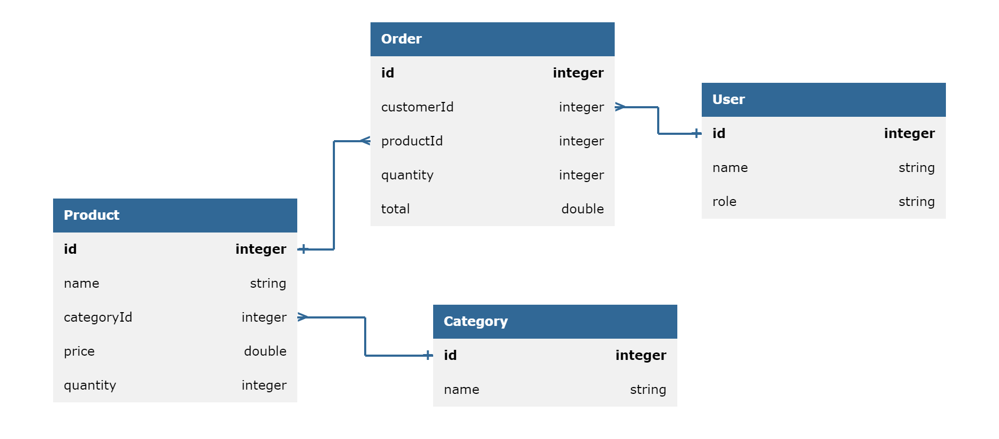

# Inventory Management System

## Entity



## API Methods

<!-- Create Product -->

1. **POST /api/v1/product?user-id={user_id}**

   *To insert a new product*

   | Query Parameters | Details                                                        |
   |------------------|----------------------------------------------------------------|
   | user-id          | required\<integer> The id of the user who wants to add product |

    - request-body:

       ```json
        {
            "name": "Recycled Bronze Computer",
            "categoryId": 5029,
            "price": 431.63,
            "quantity": 5
        }
       ```

    - response-status : 200
    - response-body :
    
       ```json
        {
            "message": "Product created successfully",
            "id" : 1402
        }
       ```

   <!-- Create Category -->

2. **POST /api/v1/category?user-id={user_id}**

   *To insert a new Category*

   | Query Parameters | Details                                                         |
   |------------------|-----------------------------------------------------------------|
   | user-id          | required\<integer> The id of the user who wants to add category |

   - request-body:
    ```json
    {
    "name":"Electronics"
    }
    ```

   - response-status : 200
   - response-body :
      ```json
      {
          "message":"Category created successfully",
          "id" : 375
      }
      ```

         <!-- List products by Category -->

3. **GET /api/v1/product?id={product_id}&category-id={category_id}&page={page_number}**

   *To get details of product*

   | Query Parameter | Details                                                                                                                      |
   |-----------------|------------------------------------------------------------------------------------------------------------------------------|
   | product-id      | optional\<integer> This parameter is used to get the details of the product with the given product_id                        |
   | category-id     | optional\<integer> This parameter is used to get the details of the product with the given category_id                       |
   | page            | optional\<integer> This parameter is used for page wise result as only 25 products are displayed at once (Default value : 1) |

   NOTE : If no parameters are specified, details of all products are returned

    - response-status:200
    - response-body :

   ```json
    {
    "products": [
            {
            "id": 73529,
            "name": "Bespoke Fresh Salad",
            "categoryId": 6104,
            "price": 208.91,
            "quantity": 14
            },
            {
            "id": 12038,
            "name": "Licensed Wooden Chair",
            "categoryId": 6104,
            "price": 660.42,
            "quantity": 3
            },
            {
            "id": 52639,
            "name": "Gorgeous Metal Cheese",
            "categoryId": 6104,
            "price": 685.09,
            "quantity": 20
            }
        ]
    }
   ```

    <!-- List Category -->
4. **GET /api/v1/category?category-id={category_id}&page={page_number}**

   *To get details of a category using its id*

   | Query Parameter | Details                                                                                                                                 |
   |-----------------|-----------------------------------------------------------------------------------------------------------------------------------------|
   | category-id     | optional\<integer> This parameter is the id of the category whose details are to be fetched category details with the given category-id |
   | page            | optional\<integer> This parameter is used for page wise result as only 25 products are displayed at once (Default value : 1)            |

   NOTE : If no parameter are specified, details of all categories are returned

    - response-status:200
    - response-body :
   ```json
   {
       "id":5029,
       "name":"Electronics"
   }
   ```

    <!-- Update product -->
5. **PUT /api/v1/product?product-id={product_id}&name={product_name}&category={category_id}&price={product_price}&quantity={product_quantity}&user-id={user_id}**

   *To update details of a product*

   | Query Parameter | Detail                                                                                       |
   |-----------------|----------------------------------------------------------------------------------------------|
   | product-id      | required\<integer> The id of the product to be updated                                       |
   | product-name    | optional\<string> The new name to replace the existing product name                          |
   | category-id     | optional\<integer> The ID of the category to replace the existing category ID of the product |
   | price           | optional\<double> The new price to replace the existing price of the product                 |
   | quantity        | optional\<integer> The new quantity to replace the existing quantity of the product          |
   | user-id         | required\<integer> The id of the user, who wants to update                                   |

   NOTE : At least 1 of the optional parameters should be specified

    - response-status:200
    - response-body :

   ```json
    {
        "message": "Successfully updated product"
    }
   ```

    <!-- Update category -->
6. **PUT /api/v1/category?category-id={category_id}&name={category_name}&user-id={user_id}**

   *To update the name of a category*

   | Query Parameters | Details                                                                     |
   |------------------|-----------------------------------------------------------------------------|
   | category-id      | required\<integer> The id of the category to be updated                     |
   | name             | required\<string> The name of the category to which it should be updated to |
   | user-id          | required\<integer> The id of the user, who wants to update                  |

    - response-status:200
    - response-body :
      ```json
      {
      "message": "Successfully updated category"
      }
      ```

    <!-- Delete product -->
7. **DELETE /api/v1/product?product-id={product_id}&user-id={user_id}**

   *To delete a product using its id*

   | Query Parameter | Details                                                    |
   |-----------------|------------------------------------------------------------|
   | product-id      | required\<integer> The id of the product to be deleted     |
   | user-id         | required\<integer> The id of the user, who wants to delete |

   - response-status:200
   - response-body :
    ```json
    {
        "message": "Successfully deleted product"
    }
    ```

       <!-- Delete category -->
8.  **DELETE /api/v1/category?category-id={category_id}&user-id={user_id}**

    *To delete a category using its id*

    | Query Parameter | Details                                                    |
    |-----------------|------------------------------------------------------------|
    | category-id     | required\<integer> The id of the category to be deleted    |
    | user-id         | required\<integer> The id of the user, who wants to delete |

    - response-status:200
    - response-body :

    ```json
    {
        "message": "Successfully deleted category"
    }
    ```

    <!-- Update product -->
9.  **PUT /api/v1/order?product-id={product_id}&quantity={qty}&user-id={user_id}**

    *To create an Order to buy items*

    | Query Parameter | Details                                                         |
    |-----------------|-----------------------------------------------------------------|
    | product-id      | required\<integer> The id of product for which the order is for |
    | quantity        | required\<integer> The quantity of the product in the order     |
    | user-id         | required\<integer> The id of the user, who wants to order       |

    - response-status: 200
    - response-body :
        
      ```json
        {
            "message": "successfully ordered"
        }
        ```
